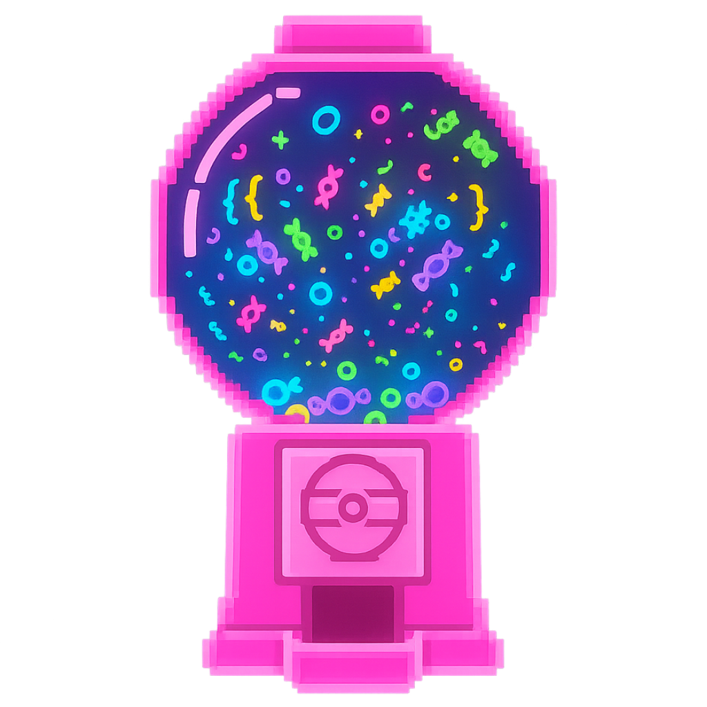
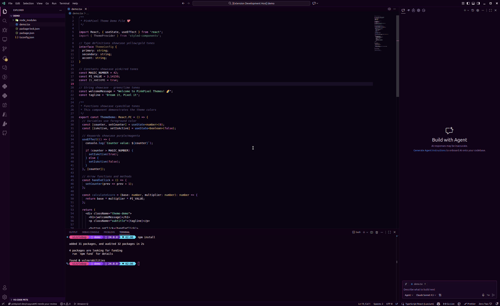
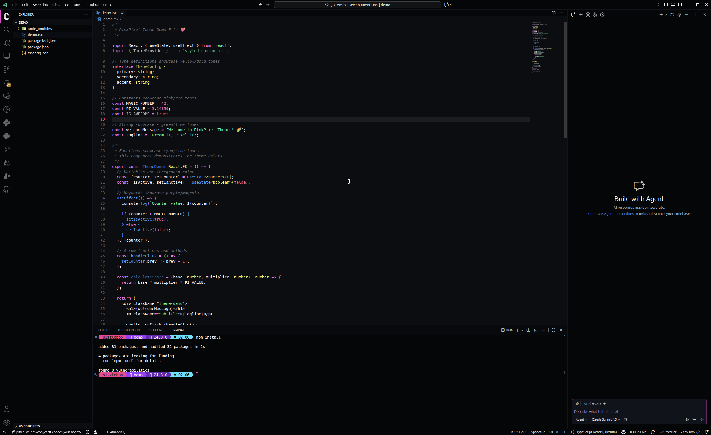
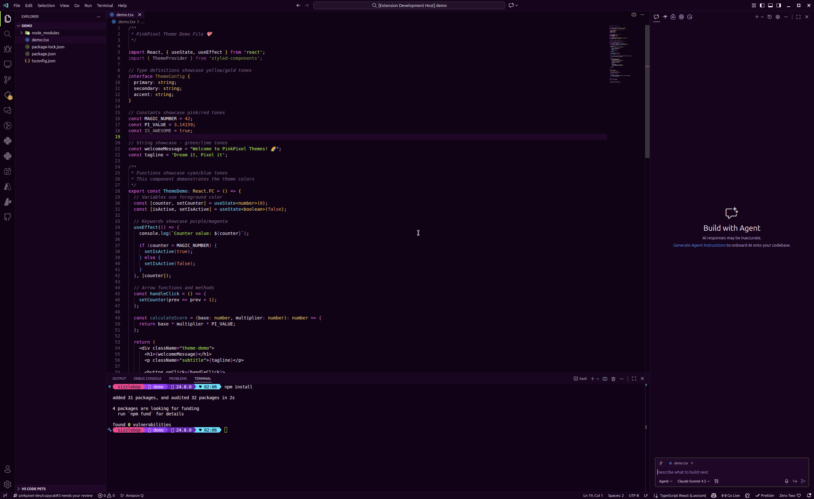
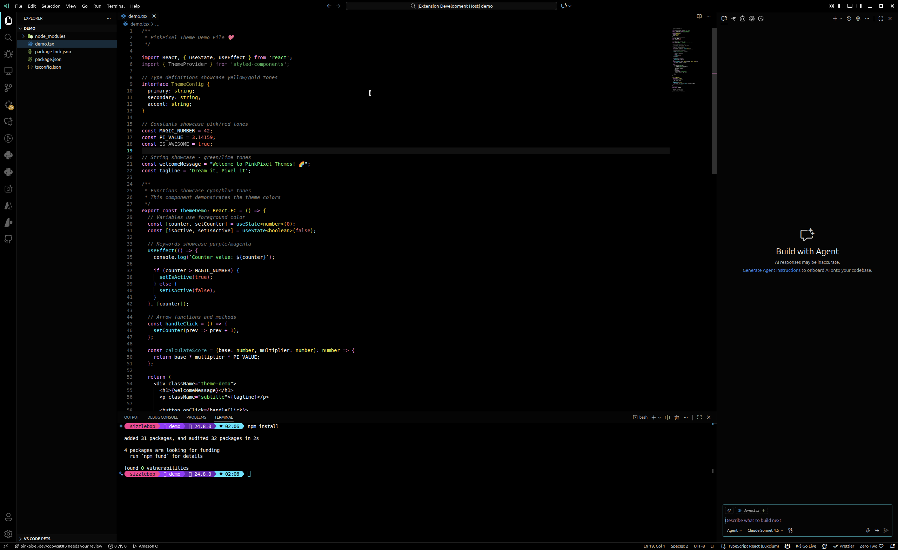
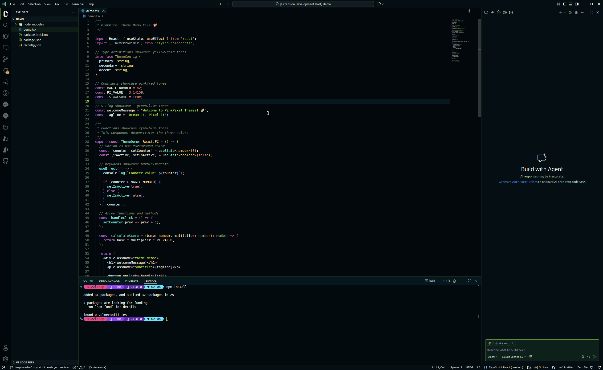

# ✨ PinkPixel VSCode Themes

**Dream it, Pixel it** 🌈

A collection of 6 vibrant, neon-inspired dark themes that transform your coding experience into a candy-coated adventure through cyberspace.

[Install](#-installation) • [Themes](#-themes) • [Features](#-features) • [Contributing](#-contributing)

---

## 🎨 Themes

### 🍬 **Candy Nebula**
Drift through a cosmic wonderland of purple stardust and candy-pink nebulas. Perfect for dreamers who code with their heart.

**Vibes:** Dreamy • Cosmic • Sweet  
**Primary Colors:** Deep Purple • Hot Pink • Mint Green • Sky Blue

---

### ⚡ **Electric Sugarstorm**
A high-voltage rush of electric magenta and neon green that'll supercharge your coding sessions. For developers who run on pure energy.

**Vibes:** Intense • Electric • Dynamic  
**Primary Colors:** Charcoal Grey • Vivid Magenta • Neon Green • Bright Yellow

---

### 🌊 **Neon Lagoon**
Dive into a tropical paradise where cyan waters meet lime shores. Refreshing and energizing like a digital vacation.

**Vibes:** Tropical • Refreshing • Aquatic  
**Primary Colors:** Deep Teal • Bright Cyan • Lime Green • Coral Pink

---

### ⚡ **Voltage Velvet**
Luxurious purple depths electrified with lime green lightning. The perfect fusion of elegance and raw power.

**Vibes:** Luxurious • Electric • Retro-Futuristic  
**Primary Colors:** Rich Violet • Lime Green • Cyan • Golden Yellow

---

### 🖤 **Hyper Noir Contrast**
Pure black canvas illuminated by brilliant neon strokes. Maximum contrast for ultimate focus and accessibility.

**Vibes:** Dramatic • Cyberpunk • High Contrast  
**Primary Colors:** True Black • Bright Cyan • Neon Green • Hot Pink

---

### 🌟 **Photon Storm Contrast**
Bio-luminescent energy crackling through the darkness. High contrast with a sci-fi edge.

**Vibes:** Sci-Fi • Bio-Luminescent • Matrix-Inspired  
**Primary Colors:** Dark Blue-Green • Electric Lime • Cyan • Magenta

---

## 📦 Installation

### **From VS Code Marketplace** (Coming Soon)
1. Open VS Code
2. Go to **Extensions** (`Ctrl+Shift+X` / `Cmd+Shift+X`)
3. Search for **"PinkPixel VSCode Themes"**
4. Click **Install**
5. Open Command Palette (`Ctrl+Shift+P` / `Cmd+Shift+P`)
6. Select **"Preferences: Color Theme"**
7. Choose your favorite PinkPixel theme! 🎉

### **Manual Installation** (For Development/Testing)
1. Clone or download this repository
2. Copy the `pinkpixel-vscode-themes` folder to your VS Code extensions directory:
   - **Windows:** `%USERPROFILE%\.vscode\extensions\`
   - **macOS:** `~/.vscode/extensions/`
   - **Linux:** `~/.vscode/extensions/`
3. Reload VS Code
4. Select your theme via Command Palette → **"Preferences: Color Theme"**

---

## ✨ Features

### 🎯 **Complete Coverage**
Every single VS Code interface element is meticulously themed - from the editor to the terminal, from peek views to AI chat interfaces. No detail left unstyled!

### 🖥️ **Terminal Paradise**
Custom ANSI color palettes (16 colors each) that match each theme's aesthetic. Your terminal will be as beautiful as your code.

### 📝 **Markdown Optimized**
Special styling for markdown files with distinct colors for headings, bold, italic, quotes, and code blocks. Perfect for documentation lovers.

### ♿ **Accessibility First**
High contrast variants (**Hyper Noir Contrast** & **Photon Storm Contrast**) ensure everyone can code comfortably.

### 🎭 **Semantic Syntax**
Consistent color meanings across all themes:
- 🔵 **Functions** - Cyan/Blue tones
- 🟢 **Strings** - Green/Lime tones
- 🟡 **Types** - Yellow/Gold tones
- 🔴 **Numbers** - Pink/Red tones
- 💜 **Keywords** - Purple/Magenta tones

### 🐛 **Debug Mode**
Distinct status bar styling when debugging - you'll always know what mode you're in.

---

## 🖼️ Screenshots

### 🍬 Candy Nebula

---

### ⚡ Electric Sugarstorm

---

### 🌊 Neon Lagoon

---

### ⚡ Voltage Velvet

---

### 🖤 Hyper Noir Contrast

---

### 🌟 Photon Storm Contrast

---

## 🎮 Theme Selector Cheat Sheet

**Need help choosing?** Here's our quick guide:

| **If you like...** | **Try this theme** |
|--------------------|--------------------|
| Cosmic vibes, dreamy aesthetics | 🍬 **Candy Nebula** |
| High energy, maximum intensity | ⚡ **Electric Sugarstorm** |
| Tropical, refreshing colors | 🌊 **Neon Lagoon** |
| Retro-futuristic luxury | ⚡ **Voltage Velvet** |
| Maximum contrast, accessibility | 🖤 **Hyper Noir Contrast** |
| Sci-fi, Matrix aesthetic | 🌟 **Photon Storm Contrast** |

---

## 🛠️ Compatibility

✅ **VS Code:** Version 1.80.0 or higher  
✅ **Platforms:** Windows, macOS, Linux  
✅ **File Types:** All languages supported (TypeScript, Python, JavaScript, Rust, Go, etc.)  
✅ **Extensions:** Works seamlessly with popular extensions  

---

## 🤝 Contributing

We love contributions! Whether it's bug reports, feature requests, or theme suggestions - your input makes these themes better for everyone.

**Ways to contribute:**
- 🐛 Report bugs or theme inconsistencies
- 💡 Suggest new theme variants or color tweaks
- 📸 Submit screenshots showing themes in action
- 🌟 Share the love by starring the repo!

See [CONTRIBUTING.md](CONTRIBUTING.md) for detailed guidelines.

---

## 📄 License

This project is licensed under the **Apache License 2.0** - see the [LICENSE](LICENSE) file for details.

---

## 🌐 Connect with Pink Pixel

**Website:** [pinkpixel.dev](https://pinkpixel.dev)  
**GitHub:** [@pinkpixel-dev](https://github.com/pinkpixel-dev)  
**Discord:** @sizzlebop  
**Email:** admin@pinkpixel.dev  
**Support:** [Buy me a coffee ☕](https://www.buymeacoffee.com/pinkpixel)

---

## 💖 Acknowledgments

Huge thanks to:
- The VS Code team for an amazing editor and extension API
- All the developers who inspire us with their colorful setups
- Everyone who uses and shares these themes! You make coding more colorful 🌈

---

### Made with ❤️ by Pink Pixel

**✨ Dream it, Pixel it ✨**

*Transform your code editor into a neon wonderland*

